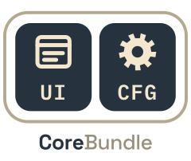
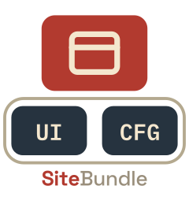
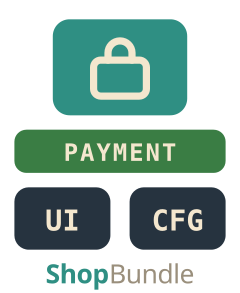
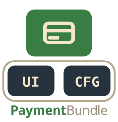
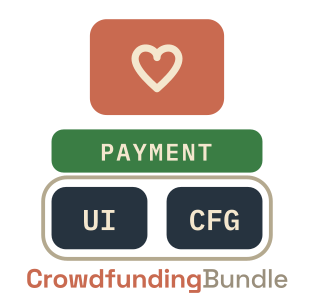
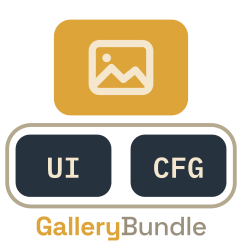
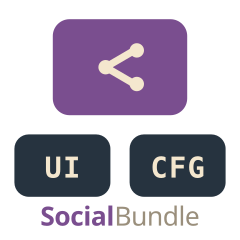

# c975L

Open-source Symfony bundles for building websites — a shared EasyAdmin back-office, database-backed
configuration, composable page blocks, e-commerce and more, each bundle usable on its own but designed
to plug into the others.

Maintained by [Laurent Marquet](https://github.com/LaurentMarquet) · PHP 8.4 · Symfony 8 · EasyAdmin 5 · MIT

## The core

| | Package | What it does |
|---|---|---|
|  | [CoreBundle](https://github.com/975L/CoreBundle)   `c975l/core-bundle` | The base of the ecosystem in a single package. **ConfigBundle** — database-backed application configuration (`site_config`), the shared `/management` dashboard, user accounts, health check, backup, sitemaps, redirects. **UiBundle** — composable page Blocks, media library and site graphics, admin-editable theme, cookie banner, legal documents, database-driven forms, email templates, reviews, ratings and favorites, shared CSS/JS. Both contribute the **guided tour** — built on its own from whatever menus are installed — and the **guided projects** that walk an admin through a real task, screen by screen. A site naming more than one language gets **content translations** too: a text is said again in another language beside the one it was written in, never in place of it. |

One package, **two bundles**: `c975L\ConfigBundle\` and `c975L\UiBundle\` keep their own namespaces,
services, configs, translation domains and dashboard sections — there is no `c975L\CoreBundle\`
namespace. They referenced each other in both directions and could never be released independently,
so they are now released together. `c975l/config-bundle` and `c975l/ui-bundle` are superseded by this
package; see [CoreBundle's UPGRADE.md](https://github.com/975L/CoreBundle/blob/main/UPGRADE.md) —
no `use`, no `@c975LUi/…` template reference and no `bundles.php` entry changes.

## The bundles

Every bundle below rests on the core, and only on the core (plus PaymentBundle where checkout is
involved). None of them rests on another.

| | Bundle | What it does | Also requires |
|---|---|---|---|
|  | [SiteBundle](https://github.com/975L/SiteBundle)   `c975l/site-bundle` | Website foundation — full layout, database-driven pages, navbar and footer menus, collections, per-page SEO and health check, and a site said in several languages: locale-prefixed urls, a Translate screen per page and per menu, `hreflang` in the head and in the sitemap | — |
|  | [ShopBundle](https://github.com/975L/ShopBundle)   `c975l/shop-bundle` | E-commerce — product catalog with categories, media, downloadable files, shipping weights, verified buyer reviews and affinity recommendations | Payment |
|  | [PaymentBundle](https://github.com/975L/PaymentBundle)   `c975l/payment-bundle` | Generic basket/checkout engine, Stripe and Revolut payments, promotional codes and gift cards, invoices and a delivery grid of zones and weight tiers; any bundle plugs its own sellable items in through `BasketItemProviderInterface` | — |
|  | [CrowdfundingBundle](https://github.com/975L/CrowdfundingBundle)   `c975l/crowdfunding-bundle` | Crowdfunding campaigns — counterparts, contributors, news and media — plus an optional lottery tied to a campaign | Payment |
|  | [BookBundle](https://github.com/975L/BookBundle)   `c975l/book-bundle` | A publisher's catalog of books, series and strips, with authors and illustrators as catalog entries of their own, successive versions of a text, media, video, press and marketing collections, short links and reader reviews | — |
|  | [GalleryBundle](https://github.com/975L/GalleryBundle)   `c975l/gallery-bundle` | Photo galleries — categories, batch upload, automatic derivatives, public viewer, and photographs sold as prints: a catalogue of sizes and prices, limited editions with their register and certificate, printed and shipped by a lab | Payment |
|  | [SocialBundle](https://github.com/975L/SocialBundle)   `c975l/social-bundle` | Social links managed in one place and share buttons for 15 networks | — |

Installing any of them pulls the core in, so `composer require c975l/site-bundle` is usually all you
need to start.

**A site does not need SiteBundle.** The core plus a shop, a book catalogue or a gallery is a
complete site on its own: it has a page shell, the theme, its favicon and share preview, the cookie
banner, the legal documents, accounts, redirects and the health check. SiteBundle is what adds
*pages* — a composable page tree, menus, collections and their own SEO — not what makes a site work.

## Every bundle speaks several languages

Two layers, never mixed up.

**The interface** — back-office, public screens, emails, guided projects — ships in English, French and
Spanish in every bundle, and each bundle's test suite compares every language file with the one it is
written in, so a key added without its translations fails. Adding a language is adding its files.

**The content** is translated as soon as a site names more than one language in Symfony's own
`enabled_locales`. A page, a menu, a collection item, a product and its category, a book, a serie and
its characters, a gallery and its photographs, a print format, a campaign and its tiers: each keeps one
row, one structure and one slug, and only its texts are said again — on the very same edit screen opened
in another language, beside the original, never in place of it. Then:

- the writing language keeps its bare urls, and every other one answers under `/{_locale}/…`
- a page carries `hreflang` in its head, and every bundle's sitemap declares its screens once per language with their `alternates`
- links stored in blocks and menus follow the language being read, and never lead to a 404
- a deleted row takes its translations away, and a duplicated page, book or product carries them
- a demo site is seeded in every language it declares

A site declaring one language — every site until it says otherwise — is untouched by all of it.

## The back-office explains itself

Two things come with the core and grow with every bundle installed. A **guided tour** is built on its
own from the menus the installed bundles declare — no bundle writes it, none can forget an entry.
And **83 guided projects** take an admin through a real task, step by step, highlighting the very
button or field to use where it already is: 16 in BookBundle, 11 in SiteBundle, 10 each in UiBundle,
GalleryBundle and CrowdfundingBundle, 9 in PaymentBundle, 8 in ShopBundle, 5 in ConfigBundle, 4 in
SocialBundle — translating a page, a menu, a book, a gallery, a product or a campaign among them. A
bundle contributes its own by implementing `GuidedProjectProviderInterface`.

## Start here

New to the ecosystem? Read [CoreBundle's README](https://github.com/975L/CoreBundle#readme) first —
it points at the configuration model and the dashboard extension points (`MenuProviderInterface`,
`AlertProviderInterface`, `ShortcutProviderInterface`, `SitemapProviderInterface`…) that every other
bundle plugs into.

Building a website? Start with [SiteBundle](https://github.com/975L/SiteBundle#readme).

Want to see it running? [bundles.975l.com](https://bundles.975l.com) presents every bundle, and its
[block gallery](https://bundles.975l.com/pages/blocks) shows every block kind live.

## Conventions

- Application configuration lives in the database, edited in EasyAdmin — never in `.env`
- The one exception: the languages a site speaks are declared in Symfony's own `enabled_locales`, which the framework itself reads
- A bundle contributes to the dashboard by implementing an interface; no compiler pass to write
- Assets are served through AssetMapper — no npm, no Node, no build step
- Admin controllers live in `Controller/Management/`
- Every bundle is designed to be overridden rather than forked
- A feature belongs to the bundle owning its domain, not to the one that happens to call it

## Archived

Bundles marked archived on this page are no longer maintained. Notably, `ShareButtonsBundle` and
`ContactFormBundle` have been superseded — share buttons moved to
[SocialBundle](https://github.com/975L/SocialBundle), contact forms to the core's database-driven
form system. `PurchaseCreditsBundle` predates the current architecture and is kept for existing
sites only.
